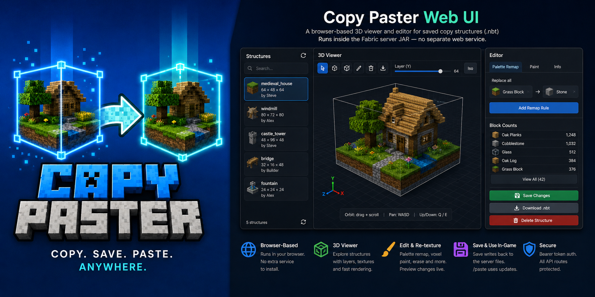

<p align="center">
  
</p>

<p align="center">
  <strong>Copy cuboid regions to files. Paste them back exactly where you mean to — anchored to your position.</strong>
</p>

<p align="center">
  
  
  
  
</p>

---

**Copy Paster** is a Fabric **client + server** mod for survival and creative builders who want a fast, visual way to duplicate structures without leaving the game. Select a box in the world, name it in chat, then paste it later — position follows **where you stand** at copy time and paste time, so offsets stay intuitive.

- **Interactive `/copy`** — click two corners; live wireframe preview while you aim  
- **Paste ghost preview** — cyan outline when blocks would be overwritten  
- **Undo** — `/pasteundo` restores the last paste (in-memory until restart)  
- **Ukrainian (`uk_ua`)** — full UI strings alongside English  
- **Configurable highlights** — `config/copypaster.yml` or optional Mod Menu + Cloth Config  
- **Web UI** (optional) — browser 3D viewer/editor with **texture-accurate** block preview, palette remap, voxel paint  

> Maintainer docs: [`CLAUDE.md`](CLAUDE.md) · Release notes: [`CHANGELOG.md`](CHANGELOG.md)

---

## Install

| Where | What |
|-------|------|
| **Dedicated server** | `copy_paster-<version>.jar` in `mods/` + **Fabric API** |
| **Each player** | **Same JAR** in client `mods/` (required for `/copy`, previews, HUD) |

**Server-only mode:** coordinate `/copy x1 y1 z1 x2 y2 z2` and all `/paste` commands still work; bare `/copy` needs the client mod.

**Optional:** [Mod Menu](https://modrinth.com/mod/modmenu) + [Cloth Config](https://modrinth.com/mod/cloth-config) for in-game highlight colour.

---

## Quick start

### 1 · Save a region

1. Stand at the **anchor** point you want for this copy.  
2. Run **`/copy`**.  
3. **Attack** corner 1, then corner 2 (blue wireframe follows your crosshair).  
4. **Use** (right-click) to cancel anytime.  
5. Type a structure name in **chat** (`a`–`z`, `0`–`9`, `_`, `-`, max 64 chars). Type **`cancel`** to abort (60 s).

**Legacy:** `/copy <x1> <y1> <z1> <x2> <y2> <z2>` then name in chat — or bind **`[`** / **`]`** under *Options → Controls → Miscellaneous* (unbound by default).

### 2 · Paste it back

1. Stand in the **same relative spot** you used when copying.  
2. `/paste <name>` — confirm with `/paste <name> confirm` if the ghost preview warns about overwrites.  
3. Save the **undo ID** from chat for `/pasteundo <id>`.

---

## Commands

| Command | Description |
|---------|-------------|
| `/copy` | Interactive block selection (client mod) |
| `/copy <x1> <y1> <z1> <x2> <y2> <z2>` | Coordinate selection |
| `/paste <name>` | Paste at player-relative anchor |
| `/paste <name> confirm` | Paste after overwrite warning |
| `/pasteundo <id>` | Restore blocks from one paste |
| `/copylist` | List saved structures |
| `/copyinfo <name>` | Size, dimension, offset, metadata |
| `/copydelete <name>` | Remove `.nbt` + `.json` |
| `/copyweb` | Print web UI URL (when enabled) |

All commands require **operator** on the server.

---

## Web UI (viewer + editor)

Optional **browser** interface for saved structures. Disabled by default.

| Feature | Description |
|---------|-------------|
| **3D viewer** | Orbit + **WASD** pan, layer slider, isometric toggle |
| **Colors / Textures** | Map-color cubes or Minecraft 1.21.4 textures (cutout, glass, entity blocks) |
| **Palette remap** | Replace one block type with another across the structure |
| **Voxel paint** | Click blocks to repaint or erase |
| **Download** | Export edited `.nbt` |

1. On the server, edit `config/copypaster-server.yml`:
   - `web.enabled: true`
   - `web.bind: 127.0.0.1` (or `0.0.0.0` for LAN/VPN)
   - `web.publicHost: 192.168.50.100` (optional URL hint in logs)
   - Copy `web.authToken` for the browser login screen
2. Restart the server. Run **`/copyweb`** in-game for the URL.
3. Open the URL, paste the token, select a structure, edit, **Save** — then `/paste` in-game as usual.

Default port: **8792** (change with `web.port`). Build embedded assets: `./gradlew buildWeb` (included in `./gradlew jar`). After a server update, hard-refresh the browser (`Ctrl+Shift+R`).

---

## Controls

| Input | Action |
|-------|--------|
| `/copy` | Start interactive selection |
| Attack block | Set corners 1 → 2 |
| Use | Cancel selection |
| **`[`** / **`]`** (if bound) | Legacy corner shortcut |

### Web viewer (when enabled)

| Input | Action |
|-------|--------|
| Drag | Orbit camera |
| Scroll | Zoom |
| **W** / **A** / **S** / **D** | Pan (click viewer first) |
| **Q** / **E** | Down / up |

---

## Limits & storage

| | |
|---|---|
| **Max volume** | 32 768 blocks |
| **Files** | Server `copypaster/structures/` — `<name>.nbt` + `<name>.json` |
| **Undo** | In memory only; cleared on server restart |
| **Highlight colour** | Client `config/copypaster.yml` |

---

## Build

```bash
./gradlew clean jar
# → build/libs/copy_paster-<version>.jar
```

Requires **Java 25**. See [`CLAUDE.md`](CLAUDE.md) for deploy runbook (Fabric on gserver).

---

## License

See repository license file if present; otherwise treat as private CrazyHouse tooling until a license is added.
